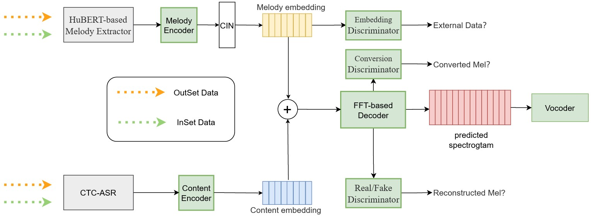

## Abstract

Singing voice conversion (SVC) is hindered by noise sensitivity due to the use of non-robust methods for extracting pitch and energy during the inference. 
As clean signals are key for the source audio in SVC, music source separation preprocessing offers a viable solution for handling noisy audio, like singing with background music (BGM). 
However, current separating methods struggle to fully remove noise or excessively suppress signal components, affecting the naturalness and similarity of the processed audio. 
To tackle this, our study introduces RobustSVC, a novel any-to-one SVC framework that converts noisy vocals into clean vocals sung by the target singer. 
We replace the non-robust feature with a HuBERT-based melody extractor and use adversarial training mechanisms with three discriminators to reduce information leakage in self-supervised representations. 
Experimental results show that RobustSVC is noise-robust and achieves higher similarity and naturalness than baseline methods in both noisy and clean vocal conditions.

 

	

 

## Conversion Tasks

Our goal is to convert audio with noise, like background music, into clean vocals performed by a target singer while preserve the
fine-grained melody information contaioned in source waveform, which
lead to high naturalness.

We will generate waveforms with high timbre similarity, naturalness and
quality.

- **Proposed** - the proposed RobustSVC system.
- **Origin Pitch&Energy** - method is the same as the proposed, except that it directly input pitch and energy into the melody encoder.
- **Separated Origin Pitch&Energy** - method utilizes
 the same model as baseline1, with the distinction that the pitch
 and energy are extracted from audio processed by a music separation model(HT-Demucs).

  
Below are a few audios samples from the target speaker.

<audio controls>
				<source src="audios\target\2013000484.wav" type="audio/mpeg">
				Your browser does not support this audio format.
			</audio>
<audio controls>
				<source src="audios\target\2013000486.wav" type="audio/mpeg">
				Your browser does not support this audio format.
			</audio>
<audio controls>
				<source src="audios\target\2075002790.wav" type="audio/mpeg">
				Your browser does not support this audio format.
			</audio>
<audio controls>
				<source src="audios\target\2075002791.wav" type="audio/mpeg">
				Your browser does not support this audio format.
			</audio>

  

### Clean Vocal

<table>
<thead>
<tr class="header">
<th>NO</th>
<th>Origin Pitch&Energy</th>
<th>Separated Origin Pitch&Energy</th>
<th>Proposed</th>

</tr>
</thead>
<tbody>
<tr class="odd">
<td>1</td>
<td><audio controls>
				<source src="audios\clean\acous\0.wav" type="audio/mpeg">
				Your browser does not support this audio format.
			</audio></td>
<td><audio controls>
				<source src="audios\clean\separated\0.wav" type="audio/mpeg">
				Your browser does not support this audio format.
			</audio></td>
<td><audio controls>
				<source src="audios\clean\proposed\0.wav" type="audio/mpeg">
				Your browser does not support this audio format.
			</audio></td>
</tr>
<tr class="even">
<td colspan="4">Source 1 transcript :
<em><strong>"我愿为他建造一个美丽的花园"</strong></em> &emsp;&emsp;&emsp;&emsp;
<audio controls>
				<source src="audios\clean\source\0.wav" type="audio/mpeg">
				Your browser does not support this audio format.
			</audio>
</td>
</tr>

<tr class="odd">
<td>2</td>
<td><audio controls>
				<source src="audios\clean\acous\1.wav" type="audio/mpeg">
				Your browser does not support this audio format.
			</audio></td>
<td><audio controls>
				<source src="audios\clean\separated\1.wav" type="audio/mpeg">
				Your browser does not support this audio format.
			</audio></td>
<td><audio controls>
				<source src="audios\clean\proposed\1.wav" type="audio/mpeg">
				Your browser does not support this audio format.
			</audio></td>
</tr>
<tr class="even">
<td colspan="4">Source 2 transcript :
<em><strong>"这就是我心里的歌"</strong></em> &emsp;&emsp;&emsp;&emsp;&emsp;&emsp;&emsp;&emsp;&emsp;
<audio controls>
				<source src="audios\clean\source\1.wav" type="audio/mpeg">
				Your browser does not support this audio format.
			</audio>
</td>
</tr>
<tr class="odd">
<td>3</td>
<td><audio controls>
				<source src="audios\clean\acous\2.wav" type="audio/mpeg">
				Your browser does not support this audio format.
			</audio></td>
<td><audio controls>
				<source src="audios\clean\separated\2.wav" type="audio/mpeg">
				Your browser does not support this audio format.
			</audio></td>
<td><audio controls>
				<source src="audios\clean\proposed\2.wav" type="audio/mpeg">
				Your browser does not support this audio format.
			</audio></td>
</tr>
<tr class="even">
<td colspan="4">Source 3 transcript :
<em><strong>"让你负气流浪"</strong></em> &emsp;&emsp;&emsp;&emsp;&emsp;&emsp;&emsp;&emsp;&emsp;&emsp;&emsp;
<audio controls>
				<source src="audios\clean\source\2.wav" type="audio/mpeg">
				Your browser does not support this audio format.
			</audio>
</td>
</tr>
<tr class="odd">
<td>4</td>
<td><audio controls>
				<source src="audios\clean\acous\3.wav" type="audio/mpeg">
				Your browser does not support this audio format.
			</audio></td>
<td><audio controls>
				<source src="audios\clean\separated\3.wav" type="audio/mpeg">
				Your browser does not support this audio format.
			</audio></td>
<td><audio controls>
				<source src="audios\clean\proposed\3.wav" type="audio/mpeg">
				Your browser does not support this audio format.
			</audio></td>
</tr>
<tr class="even">
<td colspan="4">Source 4 transcript :
<em><strong>"须臾的年风干泪痕"</strong></em> &emsp;&emsp;&emsp;&emsp;&emsp;&emsp;&emsp;&emsp;&emsp;
<audio controls>
				<source src="audios\clean\source\3.wav" type="audio/mpeg">
				Your browser does not support this audio format.
			</audio>
</td>
</tr>
<tr class="odd">
<td>5</td>
<td><audio controls>
				<source src="audios\clean\acous\4.wav" type="audio/mpeg">
				Your browser does not support this audio format.
			</audio></td>
<td><audio controls>
				<source src="audios\clean\separated\4.wav" type="audio/mpeg">
				Your browser does not support this audio format.
			</audio></td>
<td><audio controls>
				<source src="audios\clean\proposed\4.wav" type="audio/mpeg">
				Your browser does not support this audio format.
			</audio></td>
</tr>
<tr class="even">
<td colspan="4">Source 5 transcript :
<em><strong>"你可知道我唯一的想要"</strong></em> &emsp;&emsp;&emsp;&emsp;&emsp;&emsp;&emsp;
<audio controls>
				<source src="audios\clean\source\4.wav" type="audio/mpeg">
				Your browser does not support this audio format.
			</audio>
</td>
</tr>

</tbody>
</table>

  

  
   
   

### Noisy Vocal

<table>
<thead>
<tr class="header">
<th>NO</th>
<th>Origin Pitch&Energy</th>

<th>Separated Origin Pitch&Energy</th>
<th>Proposed</th>
</tr>
</thead>
<tbody>
<tr class="odd">
<td>1</td>
<td><audio controls>
				<source src="audios\noisy\acous\5.wav" type="audio/mpeg">
				Your browser does not support this audio format.
			</audio></td>
<td><audio controls>
				<source src="audios\noisy\separated\0.wav" type="audio/mpeg">
				Your browser does not support this audio format.
			</audio></td>
<td><audio controls>
				<source src="audios\noisy\proposed\5.wav" type="audio/mpeg">
				Your browser does not support this audio format.
			</audio></td>
</tr>
<tr class="even">
<td colspan="4">Source 1 transcript :
<em><strong>"如果真的遇见你"</strong></em> &emsp;&emsp;&emsp;&emsp;&emsp;&emsp;&emsp;&emsp;
<audio controls>
				<source src="audios\noisy\source\5.wav" type="audio/mpeg">
				Your browser does not support this audio format.
			</audio>

</td>
</tr>

<tr class="odd">
<td>2</td>
<td><audio controls>
				<source src="audios\noisy\acous\1.wav" type="audio/mpeg">
				Your browser does not support this audio format.
			</audio></td>
<td><audio controls>
				<source src="audios\noisy\separated\1.wav" type="audio/mpeg">
				Your browser does not support this audio format.
			</audio></td>
<td><audio controls>
				<source src="audios\noisy\proposed\1.wav" type="audio/mpeg">
				Your browser does not support this audio format.
			</audio></td>
</tr>
<tr class="even">
<td colspan="4">Source 2 transcript :
<em><strong>"我只想用我这一辈子去爱你"</strong></em> &emsp;&emsp;&emsp;
<audio controls>
				<source src="audios\noisy\source\1.wav" type="audio/mpeg">
				Your browser does not support this audio format.
			</audio>
</td>
</tr>
<tr class="odd">
<td>3</td>
<td><audio controls>
				<source src="audios\noisy\acous\2.wav" type="audio/mpeg">
				Your browser does not support this audio format.
			</audio></td>
<td><audio controls>
				<source src="audios\noisy\separated\2.wav" type="audio/mpeg">
				Your browser does not support this audio format.
			</audio></td>
<td><audio controls>
				<source src="audios\noisy\proposed\2.wav" type="audio/mpeg">
				Your browser does not support this audio format.
			</audio></td>
</tr>
<tr class="even">
<td colspan="4">Source 3 transcript :
<em><strong>"我想和你一样"</strong></em> &emsp;&emsp;&emsp;&emsp;&emsp;&emsp;&emsp;&emsp;&emsp;
<audio controls>
				<source src="audios\noisy\source\2.wav" type="audio/mpeg">
				Your browser does not support this audio format.
			</audio>
</td>
</tr>
<tr class="odd">
<td>4</td>
<td><audio controls>
				<source src="audios\noisy\acous\3.wav" type="audio/mpeg">
				Your browser does not support this audio format.
			</audio></td>
<td><audio controls>
				<source src="audios\noisy\separated\3.wav" type="audio/mpeg">
				Your browser does not support this audio format.
			</audio></td>
<td><audio controls>
				<source src="audios\noisy\proposed\3.wav" type="audio/mpeg">
				Your browser does not support this audio format.
			</audio></td>
</tr>
<tr class="even">
<td colspan="4">Source 4 transcript :
<em><strong>"谢谢你做的一切双手撑起我们的家"</strong></em> 
<audio controls>
				<source src="audios\noisy\source\3.wav" type="audio/mpeg">
				Your browser does not support this audio format.
			</audio>
</td>
</tr>
<tr class="odd">
<td>5</td>
<td><audio controls>
				<source src="audios\noisy\acous\4.wav" type="audio/mpeg">
				Your browser does not support this audio format.
			</audio></td>
<td><audio controls>
				<source src="audios\noisy\separated\4.wav" type="audio/mpeg">
				Your browser does not support this audio format.
			</audio></td>
<td><audio controls>
				<source src="audios\noisy\proposed\4.wav" type="audio/mpeg">
				Your browser does not support this audio format.
			</audio></td>
</tr>
<tr class="even">
<td colspan="4">Source 5 transcript :
<em><strong>"我爱你是多么温暖"</strong></em> &emsp;&emsp;&emsp;&emsp;&emsp;&emsp;&emsp;
<audio controls>
				<source src="audios\noisy\source\4.wav" type="audio/mpeg">
				Your browser does not support this audio format.
			</audio>
</td>
</tr>
<tr class="odd">
<td>6</td>
<td><audio controls>
				<source src="audios\noisy\acous\0.wav" type="audio/mpeg">
				Your browser does not support this audio format.
			</audio></td>
<td><audio controls>
				<source src="audios\noisy\separated\5.wav" type="audio/mpeg">
				Your browser does not support this audio format.
			</audio></td>
<td><audio controls>
				<source src="audios\noisy\proposed\0.wav" type="audio/mpeg">
				Your browser does not support this audio format.
			</audio></td>
</tr>
<tr class="even">
<td colspan="4">Source 6 transcript :
<em><strong>"哦哦原来你什么都不想要"</strong></em> &emsp;&emsp;&emsp;&emsp;
<audio controls>
				<source src="audios\noisy\source\0.wav" type="audio/mpeg">
				Your browser does not support this audio format.
			</audio>
</td>
</tr>
</tbody>
</table>

